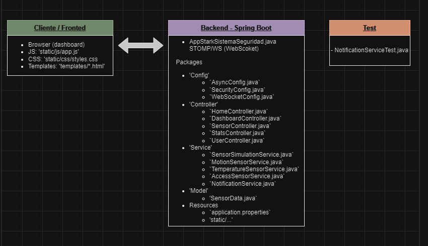

# [ PC ] Stark Industries – Sistema de Seguridad Concurrente

Enlace: https://github.com/jsepucas/PC_CasoPractico1.git

## 👥 INTEGRANTES DEL GRUPO

| Nombre  | NP            |
|----------|--------------------------------|
| **Pablo García** | 165210 |
| **Juan Sepúlveda**  | 154412 |
| **Nerea Quintanilla** | 154409 |

---

## [ 📘 ] DESCRIPCIÓN GENERAL

Este proyecto implementa un sistema de seguridad para Stark Industries capaz de monitorizar sensores de movimiento, temperatura y acceso en tiempo real. Se construyó con Spring Boot y herramientas del ecosistema Spring para proporcionar concurrencia, seguridad y comunicación en tiempo real hacia un frontend basado en Thymeleaf y Chart.js.

---

## [ 🧠 ] LÓGICA GENERAL DE LA SOLUCIÓN

1. **Gestión de sensores:**
   Cada tipo de sensor (movimiento, temperatura, acceso) está implementado como un *bean* independiente controlado por el contenedor de Spring (IoC).
   Se utiliza `@Async` junto con un `ThreadPoolTaskExecutor` para procesar los datos de forma paralela y no bloqueante.

2. **Procesamiento concurrente:**
   Los sensores generan lecturas simuladas en paralelo mediante `@Scheduled` y `@Async`.
   Estas lecturas son procesadas en tiempo real y publicadas en canales STOMP accesibles desde el frontend.

3. **Control de acceso:**
   El sistema implementa **Spring Security** con diferentes roles y reglas de acceso definidas en `SecurityConfig`.

4. **Notificaciones en tiempo real:**
   Se utiliza **WebSocket** con STOMP para enviar datos y alertas desde el backend al frontend.

5. **Monitorización y logs:**
   **Spring Actuator** está habilitado para supervisar el estado del sistema (`/actuator/health`, `/actuator/metrics`).
   Además, los servicios usan `@Slf4j` para registrar la actividad y los eventos de seguridad.

---

## [ ⚙️ ] ESTRUCTURA DEL PROYECTO

> A continuación se detallan los archivos más relevantes para comprender la solución :)

### 🏗️ Configuración y arranque
- **`AppStarkSistemaSeguridad.java`** → Clase principal del proyecto (punto de entrada). Inicializa Spring Boot y habilita `@EnableAsync` para la ejecución concurrente.
- **`application.properties`** → Configuración de servidor, logging, Actuator, WebSocket y seguridad.

### ⚙️ Configuración de Spring
- **`Config/AsyncConfig.java`** → Define el *thread pool* usado por los procesos asíncronos de los sensores.
- **`Config/SecurityConfig.java`** → Configura usuarios, roles y las reglas de acceso mediante Spring Security.
- **`Config/WebSocketConfig.java`** → Establece el endpoint WebSocket y el broker para comunicación en tiempo real.

### 📡 Controladores
- **`Controller/HomeController.java`** → Gestiona rutas de inicio y redirecciones a login o dashboard.
- **`Controller/DashboardController.java`** → Carga el panel principal y los datos del usuario autenticado.
- **`Controller/SensorController.java`** → Recibe y enruta datos de sensores hacia los servicios correspondientes.

### 🧠 Servicios
- **`Service/SensorSimulationService.java`** → Simula lecturas periódicas de sensores usando `@Scheduled` y `@Async`.
- **`Service/MotionSensorService.java`**, **`Service/TemperatureSensorService.java`**, **`Service/AccessSensorService.java`** → Procesan cada tipo de sensor y determinan condiciones críticas.
- **`Service/NotificationService.java`** → Publica los datos y alertas en los canales STOMP del frontend.

### 💾 Modelos
- **`Model/SensorData.java`** → Clase que representa cada lectura (tipo, valor, criticidad, timestamp).

### 💻 Interfaz de usuario
- **`templates/login.html`** → Página de inicio de sesión integrada con Spring Security.
- **`templates/dashboard.html`** → Panel visual con tres gráficas en tiempo real, tabla de eventos y alertas dinámicas.
- **`static/js/app.js`** → Controla las gráficas (Chart.js), eventos recientes, alertas y el estado de pausa/reinicio.
- **`static/css/styles.css`** → Estilos visuales del panel (modo oscuro, layout adaptativo).

---

## [ 📌 ]  Diagrama referenciado desde la clase principal
El diagrama de arquitectura del sistema se encuentra en el archivo `docs/architecture-diagram.svg`. A continuación se incluye una versión en imagen PNG para referencia rápida:

- Navegador: dashboard (Thymeleaf + JS) suscrito a `/topic/data` y `/topic/alerts`.
- Backend: `Config` (WebSocket/Async/Security), `Controllers`, `Services`, `Model` (`SensorData`).
- Flujos: `SensorSimulationService` -> Servicios de sensor -> `NotificationService` -> WebSocket -> Cliente.

---

## [ 📦 ] Requisitos / Pre-requisitos

- Java (JDK): versión requerida definida en `pom.xml`: Java 17.
- Maven: Apache Maven (compatible con la versión de Spring Boot usada). Se recomienda la última versión 3.x estable.
- Navegador soportado: navegadores modernos con soporte WebSocket (Chrome, Firefox, Edge). Se probó principalmente con Chrome.

### Comandos de build y test

- Compilar y ejecutar tests (completo):

    mvn clean test

- Ejecutar un test concreto (ejemplo con un test de servicio):

    mvn -Dtest=com.starkindustries.securitysystem.Service.NotificationServiceTest test

- Ejecutar la aplicación desde consola (método rápido durante desarrollo):

    mvn spring-boot:run

## [ ▶️ ] Ejecutar desde IntelliJ

1. Abrir el proyecto en IntelliJ (File → Open) seleccionando la carpeta raíz del proyecto.
2. Esperar a que IntelliJ importe el proyecto Maven y descargue dependencias.
3. Localizar la clase principal `AppStarkSistemaSeguridad.java` (paquete `com.starkindustries.securitysystem`).
4. Ejecutar con Run → Run 'AppStarkSistemaSeguridad' o crear una configuración de ejecución tipo 'Application'.

## ⚙️ Variables importantes en `application.properties`

Archivo: `src/main/resources/application.properties` — variables clave que puedes ajustar:

- `server.port` (por defecto `8080`): puerto donde escucha la aplicación.
  - Cambiar para evitar conflictos con otros servicios.
- `logging.level.root` (por defecto `INFO`): nivel de logs. Para desarrollo puedes usar `DEBUG`.
- `logging.pattern.console`: formato de salida de logs en consola.
- `management.endpoints.web.exposure.include`: controla qué endpoints de Actuator se exponen (por defecto: `health,info,metrics,prometheus`).
- `management.endpoint.health.show-details`: puede valer `always` para mostrar detalles de salud.

Dónde cambiarlas: editar `src/main/resources/application.properties` y reiniciar la aplicación. Para perfiles (p. ej. `application-dev.properties`) puedes añadir archivos de propiedades por perfil y activar con `-Dspring.profiles.active=dev`.

---

## [ 📚 ] REFERENCIAS

- [Spring Framework Documentation](https://spring.io/projects/spring-framework)
- [Spring Boot Reference Guide](https://spring.io/projects/spring-boot)
- [Spring Security Reference](https://spring.io/projects/spring-security)
- [Baeldung: Spring WebSocket + STOMP Guide](https://www.baeldung.com/websockets-spring)
